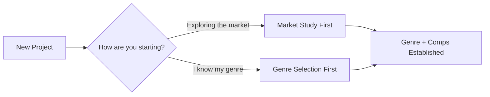
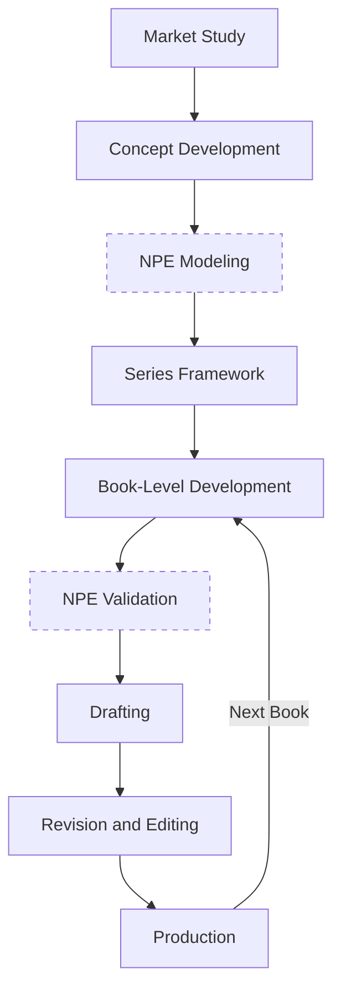
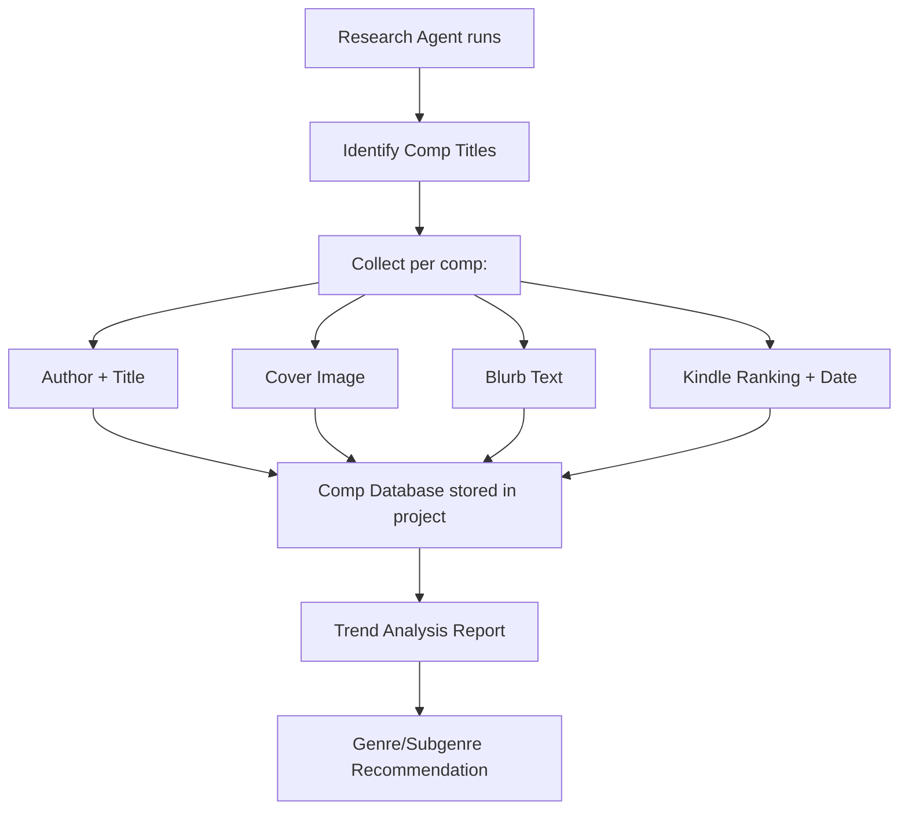
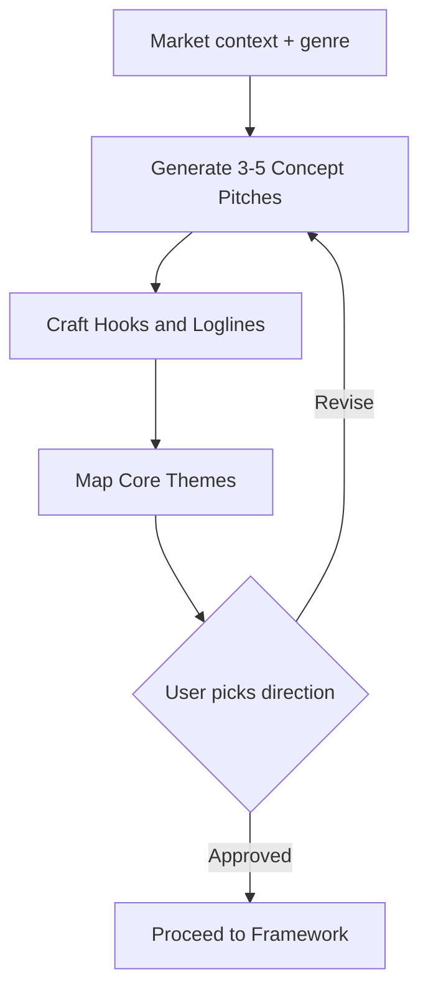
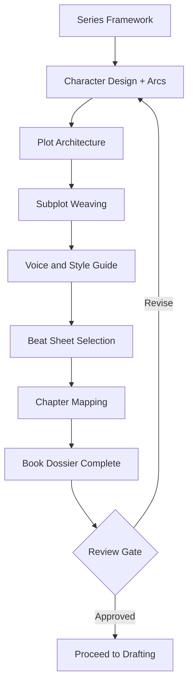
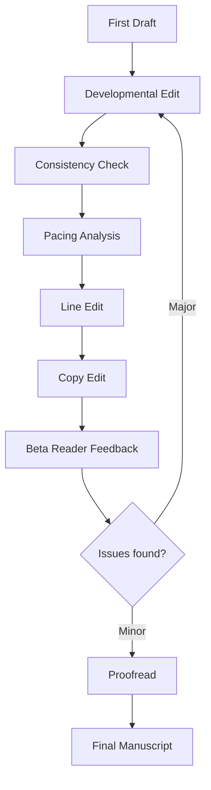
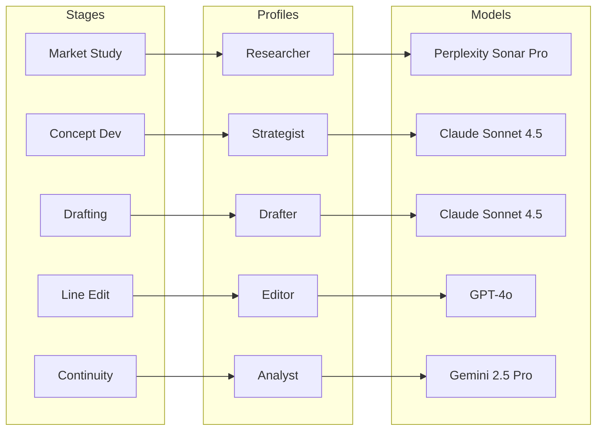
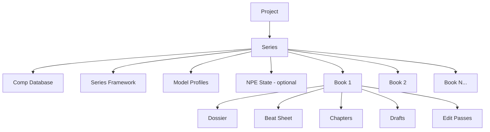
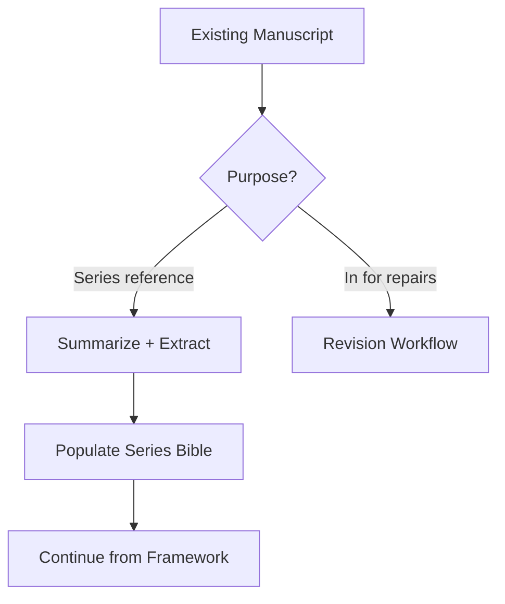
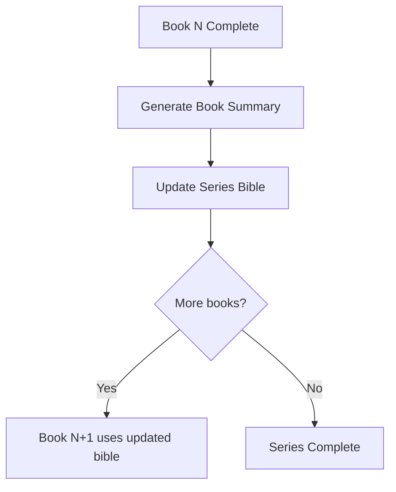

# Arcwright Workflow Architecture

## 1. Project Entry

Two paths in, one convergence point.

---

## 2. Full Pipeline — Stage Sequence

NPE stages are optional. All stages are composable modules.

> Dashed borders = optional NPE stages. Without NPE, the flow goes Concept → Framework → Book Dev → Drafting.

---

## 3. Phase Detail — Market Study

---

## 4. Phase Detail — Concept Development

---

## 5. Phase Detail — Book Development

---

## 6. Phase Detail — Revision

---

## 7. Model Profiles

Stages bind to roles. Users configure what model backs each role.

---

## 8. Data Model

---

## 9. Three Presets

| Preset | Stages Included |
|---|---|
| **Full** | Market → Concept → NPE → Framework → Book Dev → NPE Validation → Draft → Revise → Produce |
| **Streamlined** | Market → Concept → Framework → Book Dev → Draft → Revise → Produce |
| **Custom** | User picks and orders from all available stages |

## 10. Existing Manuscript Entry

Two purposes, two entry points into the pipeline.

---

## 11. Book Completion Cycle

---

## 12. Minimum Viable Path

---

## 13. Custom Stages + Beta Feedback

- **Custom stages:** Same UI pattern as adding a beat in Scaffold — insert, remove, reorder
- **Beta reader feedback:** Re-enters at the revision entry point, severity determines how far back

---

## Resolved Decisions

| # | Decision | Answer |
|---|---|---|
| 1 | Book or series? | Series-first. Standalone = 1-book series |
| 2 | Market study or genre first? | Flexible entry — user chooses |
| 3 | Model selection | Model profiles — named roles bound to provider/model |
| 4 | NPE required? | Three presets: Full, Streamlined, Custom |
| 5 | Existing manuscript? | Two paths: series reference or repairs |
| 6 | Book N+1 inheritance? | Summaries + bible update at each book completion |
| 7 | Custom stages? | Scaffold-style UI — add, remove, reorder |
| 8 | Minimum viable path? | Genre → Premise → Bible → Outline → Draft |
| 9 | Beta reader loop? | Re-enters at revision entry point |

