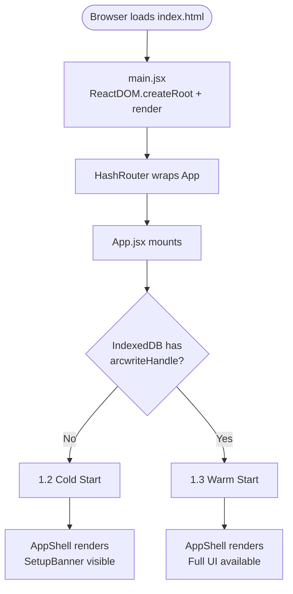
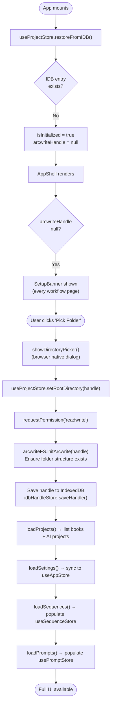
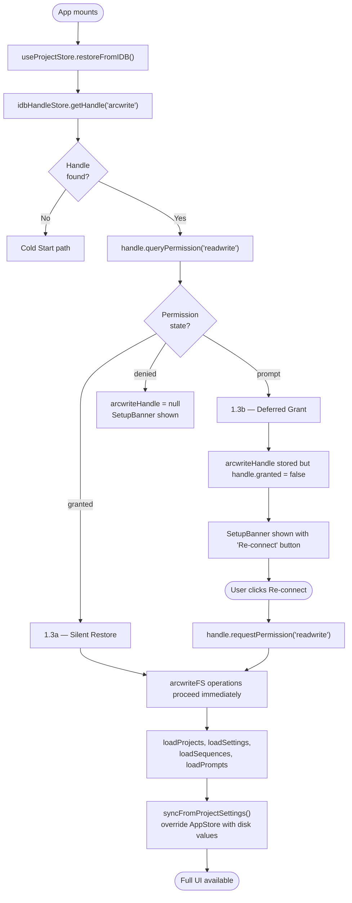
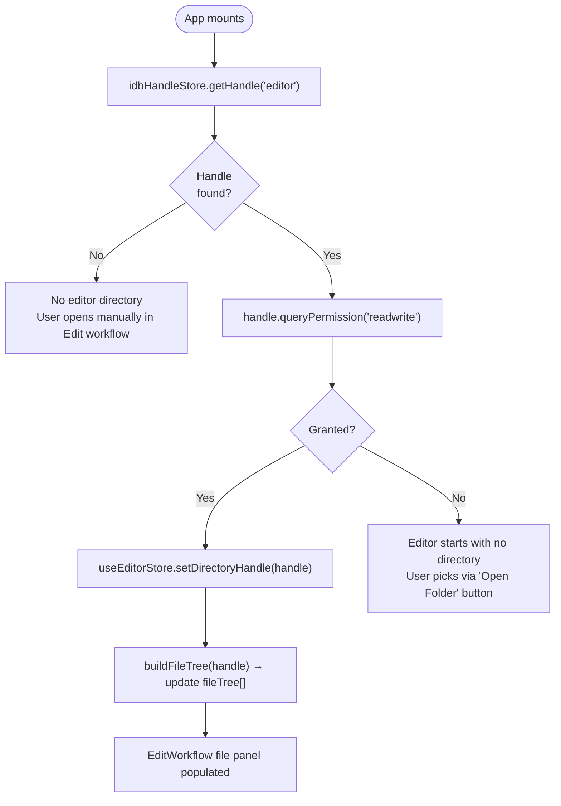
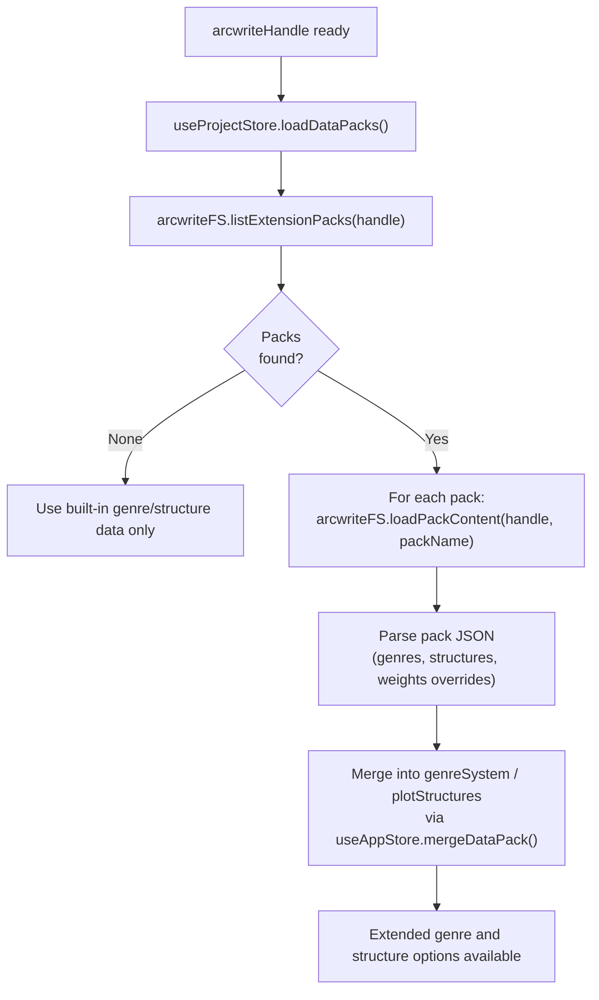
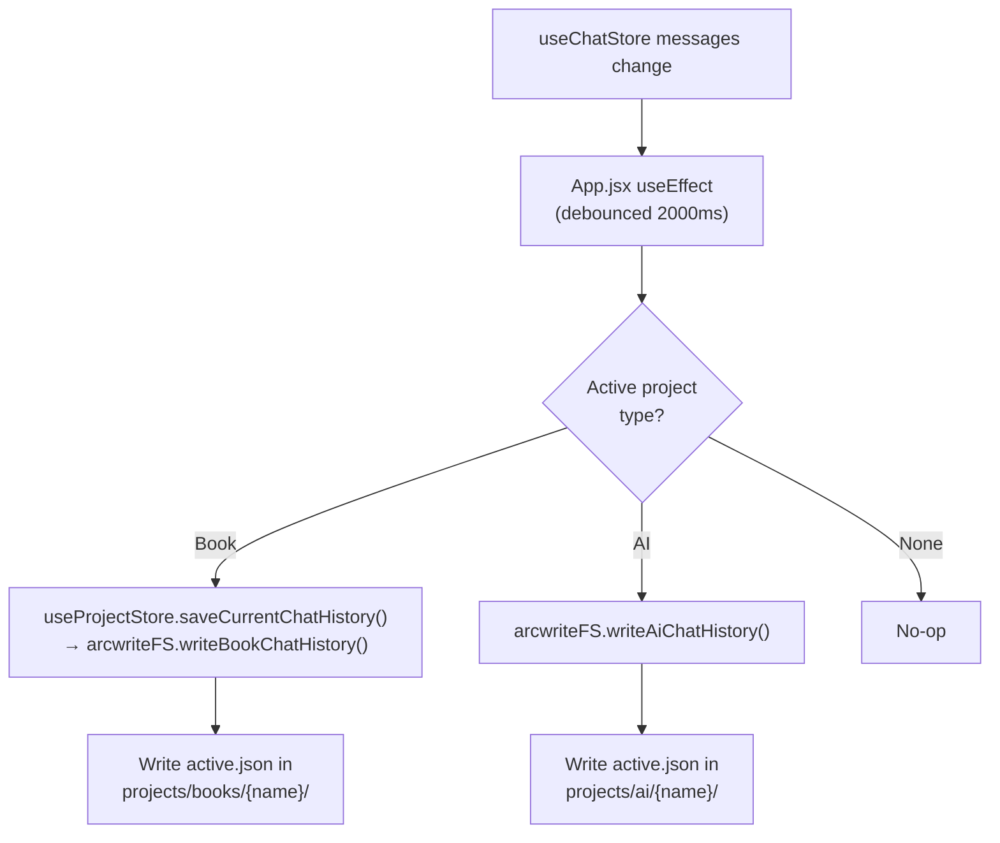

# 1 — Startup & Initialization

> **Entry points covered:** Cold start (no stored handle), Warm start (handle restored from IndexedDB), Permission re-grant (handle exists but permission lapsed).

---

## 1.1 — Top-Level Boot Sequence

---

## 1.2 — Cold Start (No Storage Handle)

User has never picked a folder, or cleared site data.

---

## 1.3 — Warm Start (Handle in IndexedDB)

User returns; browser may or may not retain permission.

---

## 1.4 — Editor Directory Handle Restore

Independent from arcwrite handle — for the file editor open-folder feature.

---

## 1.5 — Data Pack / Extension Load

Happens after arcwrite handle is valid.

---

## 1.6 — Chat History Persistence (Runtime)

Not a startup concern but defined in App.jsx alongside boot effects.

---

## 1.7 — Key Files

| File | Role |
|------|------|
| `src/main.jsx` | ReactDOM bootstrap, router wrapping |
| `src/App.jsx` | Mount effects: restore handles, load data, set up chat debounce |
| `src/store/useProjectStore.js` | `restoreFromIDB`, `setRootDirectory`, `loadProjects`, `loadSettings` |
| `src/services/arcwriteFS.js` | `initArcwrite`, `listBookProjects`, `readSettings`, `writeSettings` |
| `src/services/idbHandleStore.js` | `saveHandle`, `getHandle` — IndexedDB wrapper |
| `src/components/projects/SetupBanner.jsx` | "Pick Folder" UI shown when no handle |
