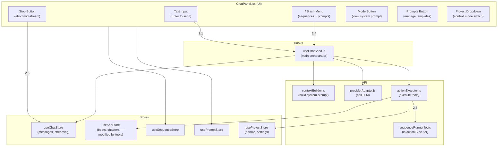
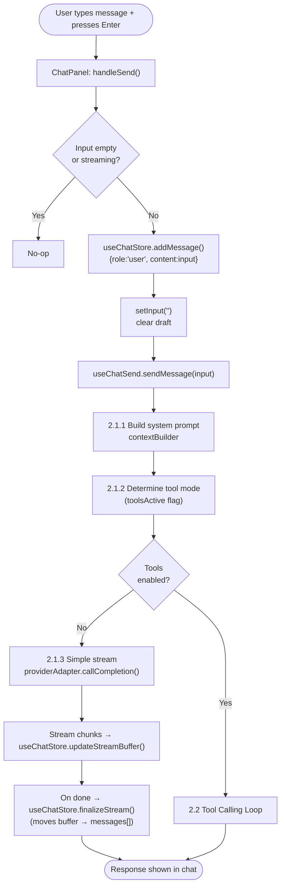
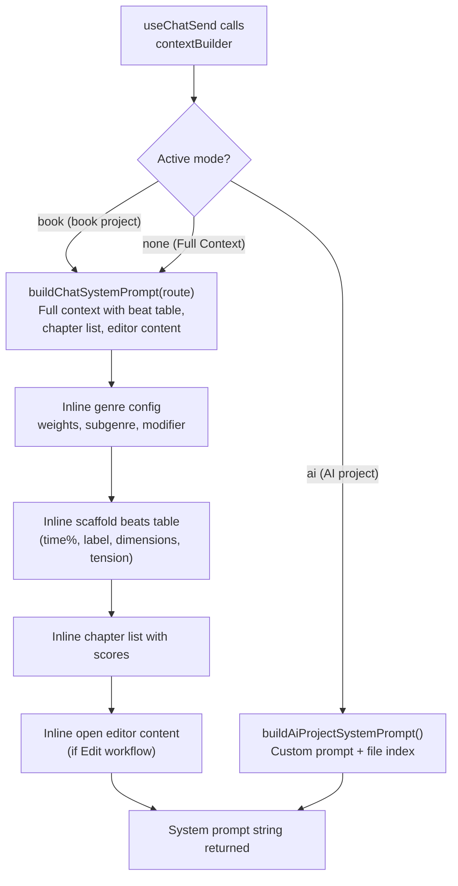
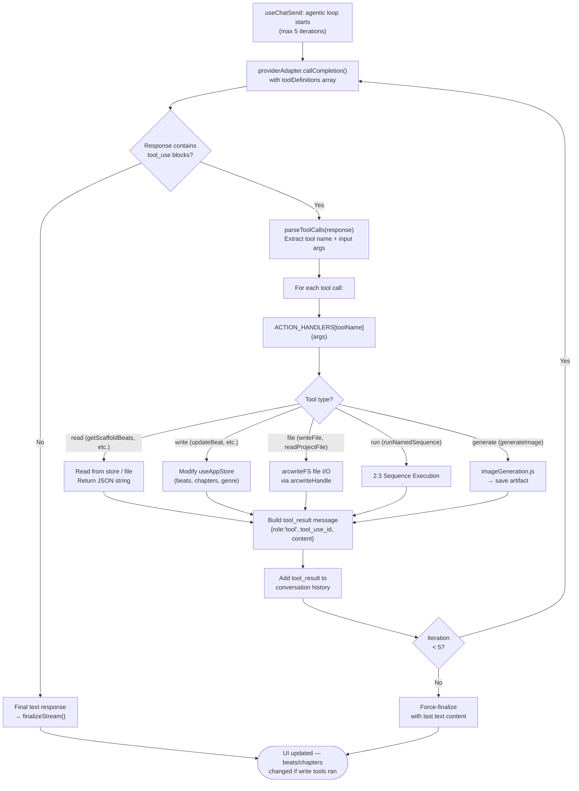
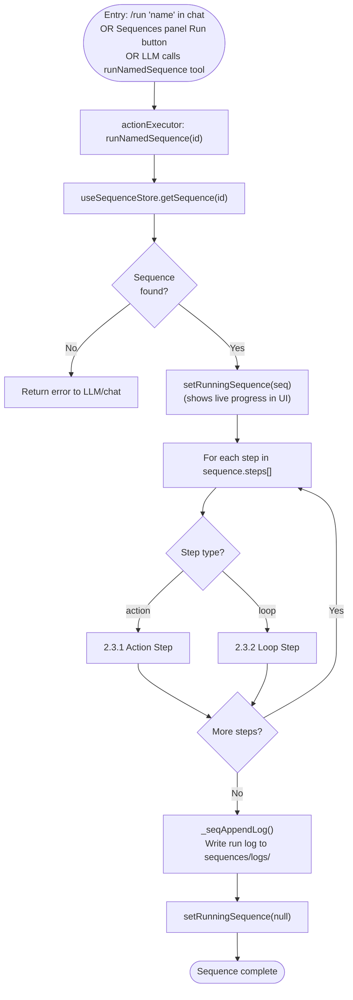
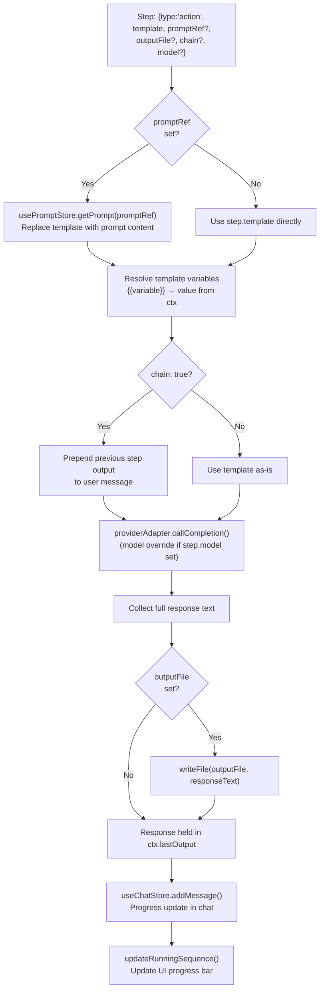
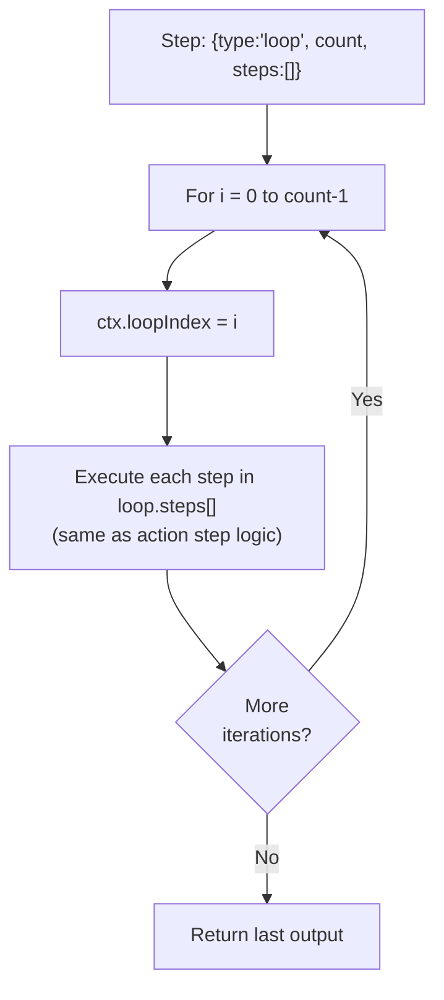
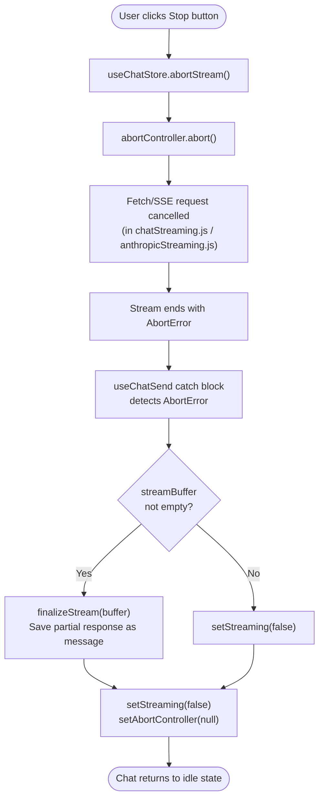
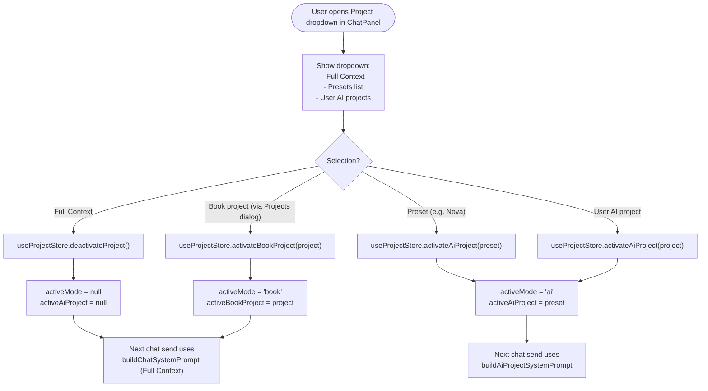

# 2 — Chat System

> **Entry points covered:** Send message (2.1), Tool calling loop (2.2), Sequence execution (2.3), Slash menu (2.4), Abort stream (2.5).

---

## 2.0 — Chat System Overview



---

## 2.1 — Send Chat Message



### 2.1.1 — Build System Prompt



---

## 2.2 — Tool Calling Loop

Executes when `toolsActive = true` and LLM returns `tool_use` blocks.



---

## 2.3 — Sequence Execution

Sequences are stored as JSON in `Arcwrite/sequences/`. Each has an array of steps.



### 2.3.1 — Sequence Action Step



### 2.3.2 — Loop Step



---

## 2.4 — Slash Menu (/ Command)

```mermaid
flowchart TD
    A([User types / in chat input]) --> B{Next character\nis a space?}
    B -->|Yes| C[No menu — treat as normal text]
    B -->|No| D["setSlashMenuOpen(true)\nsetSlashQuery(text after /)"]
    D --> E["Filter sequences by name\n+ Filter prompts by title"]
    E --> F["Render floating dropdown\nGrouped: Sequences | Prompts"]
    F --> G{User action?}

    G -->|"Arrow keys"| H["Move slashIndex\n(cycles through filteredItems)"]
    G -->|"Enter or click"| I["handleSlashSelect(item)"]
    G -->|"Space or Escape"| J["setSlashMenuOpen(false)"]

    H --> F

    I --> K{item._type?}
    K -->|sequence| L["setInput('/run \"name\"')\nuseChatSend will detect /run prefix"]
    K -->|prompt| M["setInput(item.content)\nTemplate text in input box\n(user edits, then sends manually)"]
    L --> N["setSlashMenuOpen(false)"]
    M --> N
    N --> O([Input populated — user sends when ready])
```

---

## 2.5 — Abort Stream



---

## 2.6 — Context Mode Switching



---

## 2.7 — Key Files

| File | Role |
|------|------|
| `src/components/chat/ChatPanel.jsx` | UI — input, slash menu, header buttons, message list |
| `src/hooks/useChatSend.js` | Orchestrator — system prompt, LLM call, tool loop |
| `src/chat/contextBuilder.js` | Build system prompt from app state |
| `src/chat/actionExecutor.js` | 100+ tool handlers; sequence runner |
| `src/api/providerAdapter.js` | Unified LLM call across all providers |
| `src/api/chatStreaming.js` | OpenAI-compat SSE streaming + tool call parsing |
| `src/api/anthropicStreaming.js` | Anthropic SDK streaming |
| `src/store/useChatStore.js` | messages[], streaming state, draftInput |
| `src/store/useSequenceStore.js` | Sequence library and run state |
| `src/store/usePromptStore.js` | Prompt template library |
| `src/components/chat/ChatMessage.jsx` | Render one message (markdown, actions, images) |
| `src/components/prompts/PromptEditorDialog.jsx` | CRUD UI for prompt templates |
