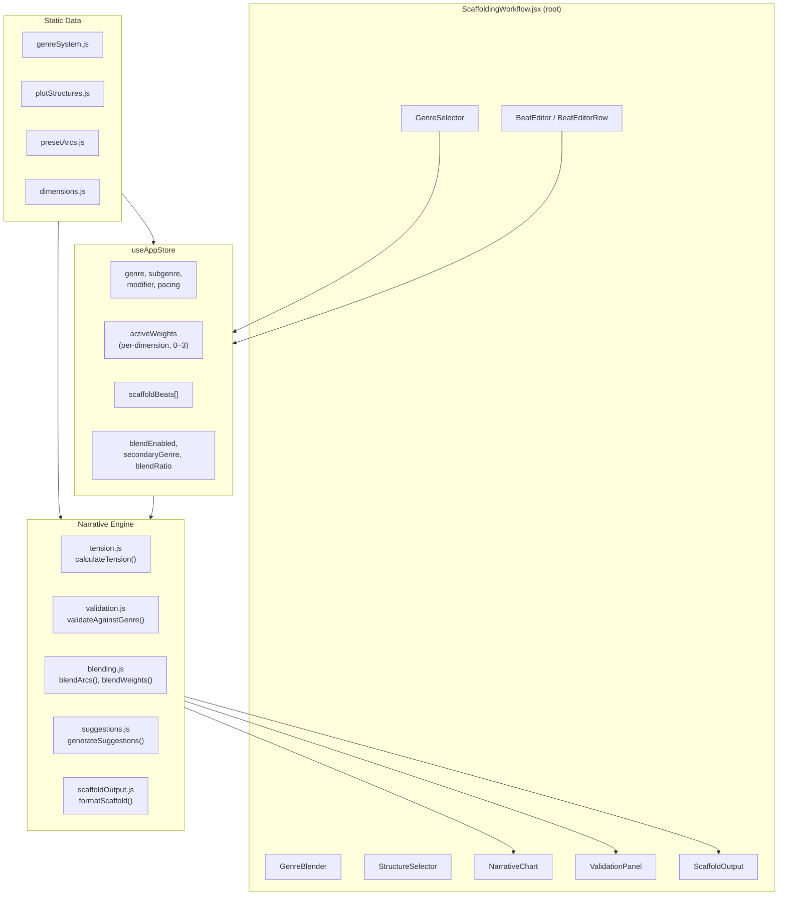
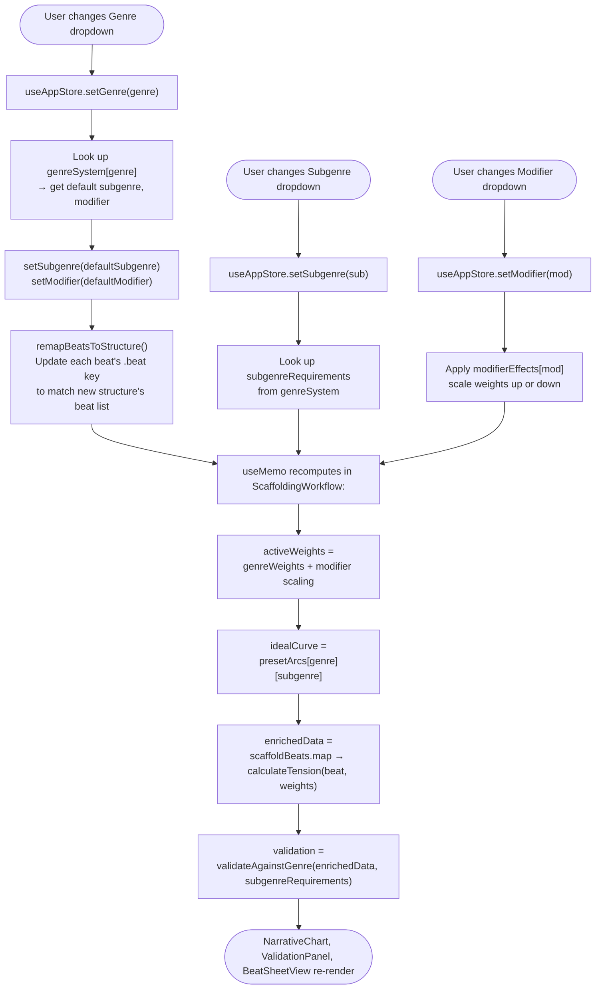
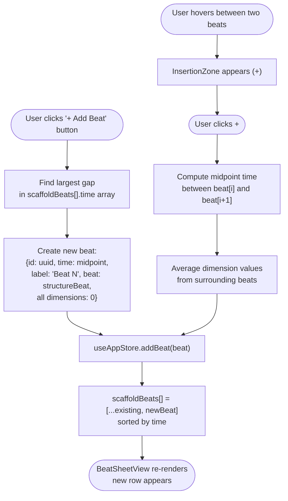
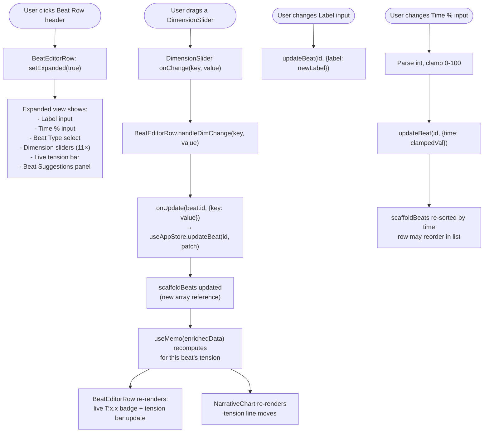
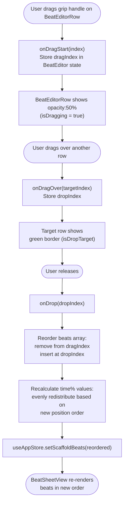
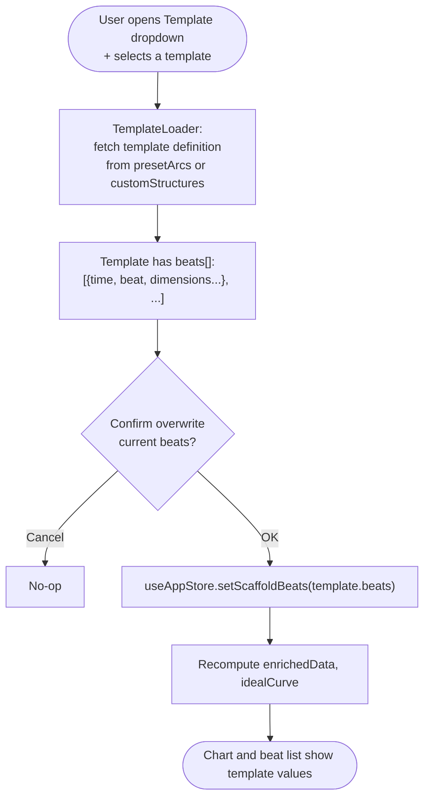
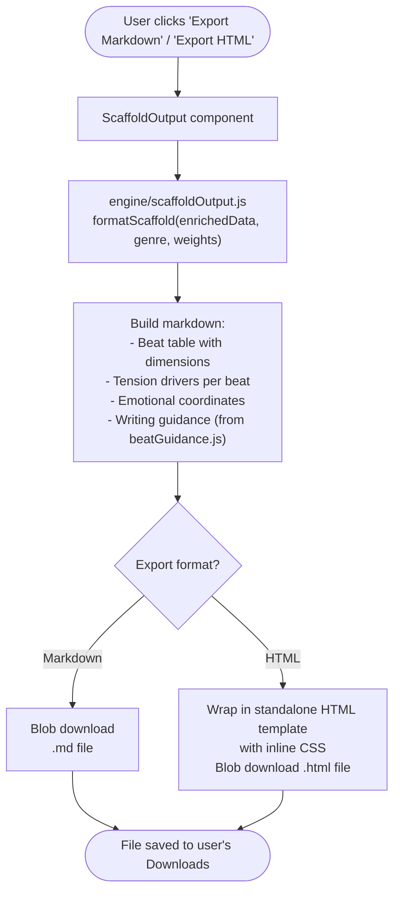
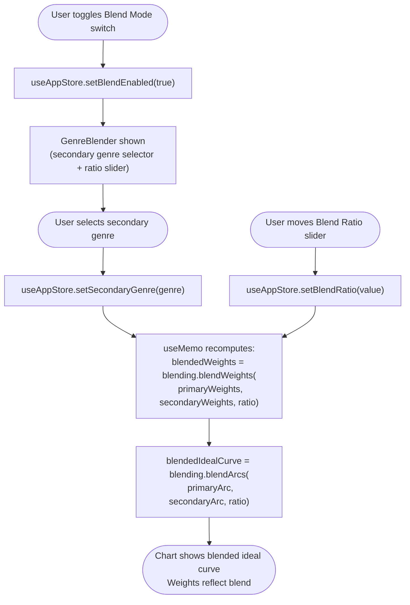
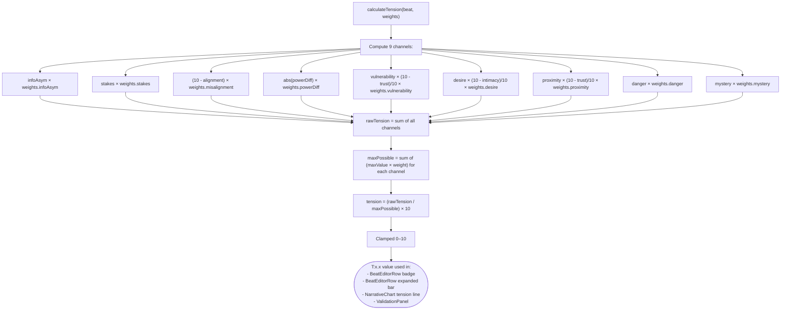

# 3 — Scaffold Workflow

> **Entry points covered:** Genre selection (3.1), Beat add/edit (3.2), Beat drag-reorder (3.3), Template load (3.4), Export (3.5). Also: blend mode, dimension toggles, tension calculation, validation.

---

## 3.0 — Scaffold Workflow Overview

---

## 3.1 — Genre Selection

---

## 3.2 — Beat Add / Edit

### 3.2.1 — Add Beat

### 3.2.2 — Edit Beat (Expand Row)

---

## 3.3 — Beat Drag-Reorder

---

## 3.4 — Template Load

---

## 3.5 — Export Scaffold

---

## 3.6 — Blend Mode

---

## 3.7 — Tension Calculation (Engine Detail)

---

## 3.8 — Key Files

| File | Role |
|------|------|
| `src/components/scaffolding/ScaffoldingWorkflow.jsx` | Root component; useMemo chains for weights/idealCurve/enrichedData/validation |
| `src/components/scaffolding/BeatEditor.jsx` | Beat add/remove orchestration |
| `src/components/scaffolding/BeatEditorRow.jsx` | Collapsed/expanded row; live tension badge |
| `src/components/scaffolding/DimensionSlider.jsx` | Single dimension slider |
| `src/components/scaffolding/BeatSuggestions.jsx` | Compare beat vs. ideal; apply suggestions |
| `src/components/scaffolding/NarrativeChart.jsx` | Recharts line chart |
| `src/components/scaffolding/StructureSelector.jsx` | Plot structure dropdown |
| `src/components/scaffolding/TemplateLoader.jsx` | Load preset arcs |
| `src/components/scaffolding/ScaffoldOutput.jsx` | Markdown/HTML export |
| `src/engine/tension.js` | `calculateTension()` — core formula |
| `src/engine/blending.js` | `blendWeights()`, `blendArcs()` |
| `src/engine/validation.js` | `validateAgainstGenre()` |
| `src/engine/suggestions.js` | Dimension suggestions vs. ideal |
| `src/engine/scaffoldOutput.js` | Format scaffold as markdown |
| `src/data/genreSystem.js` | Genre catalog |
| `src/data/plotStructures.js` | Beat structure definitions |
| `src/data/presetArcs.js` | Ideal tension curves per genre |
| `src/data/dimensions.js` | 11 dimension definitions |
| `src/store/useAppStore.js` | `scaffoldBeats`, `addBeat`, `updateBeat`, `removeBeat`, genre state |
