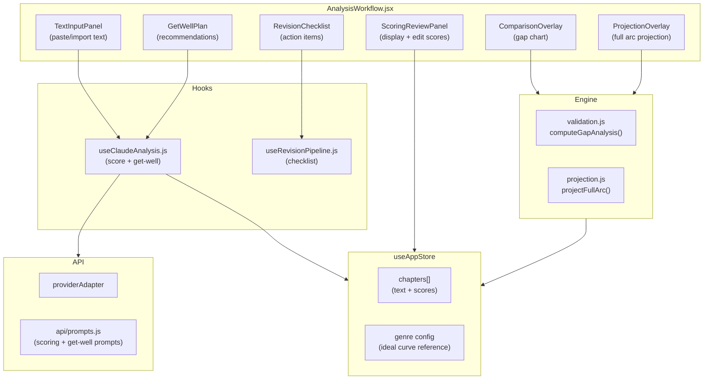
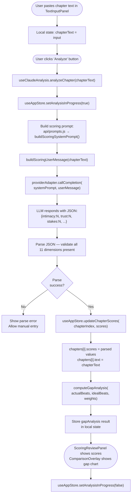
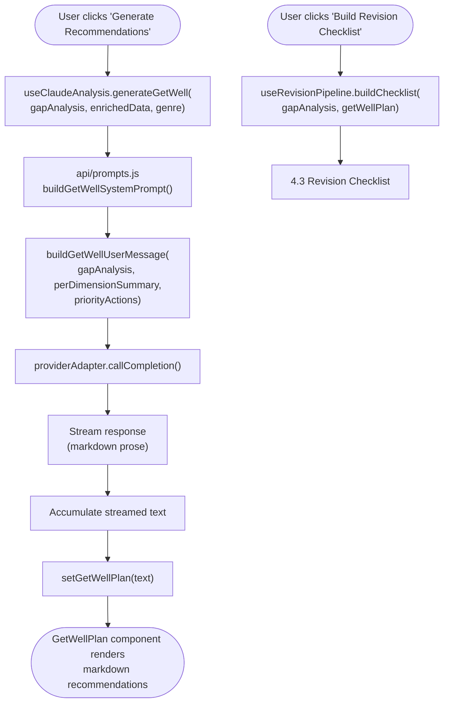
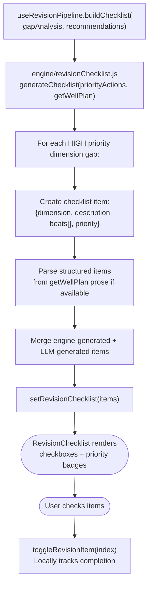
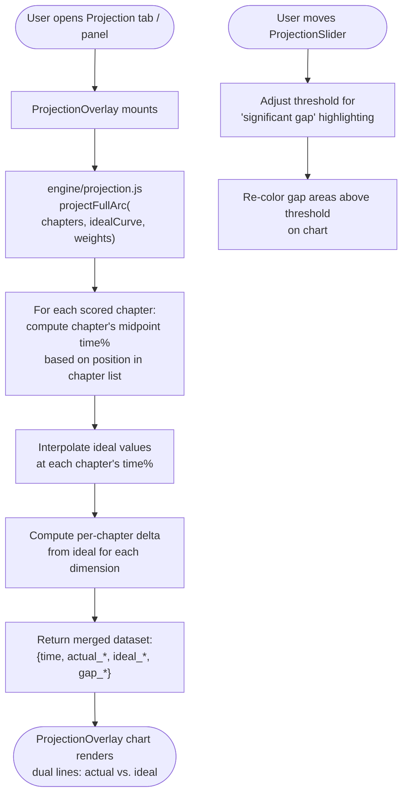
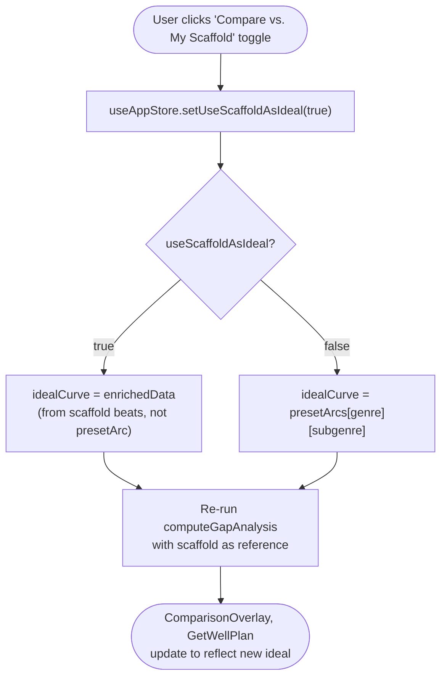
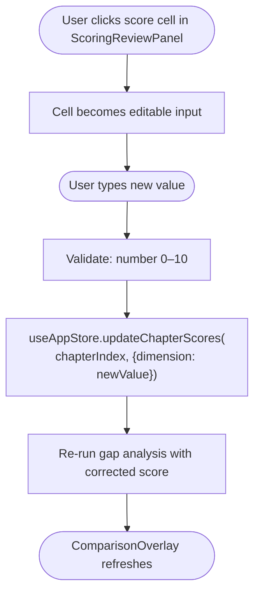

# 4 — Analysis Workflow

> **Entry points covered:** Score chapter (4.1), Get-Well Plan (4.2), Revision checklist (4.3), Projection overlay (4.4), Comparison mode toggle (4.5).

---

## 4.0 — Analysis Workflow Overview

---

## 4.1 — Score Chapter

---

## 4.2 — Get-Well Plan

Generates editorial recommendations from gap analysis.

---

## 4.3 — Revision Checklist

---

## 4.4 — Projection Overlay

Projects the full manuscript arc from scored chapters onto the ideal curve.

---

## 4.5 — Comparison Mode Toggle

---

## 4.6 — Manual Score Editing

---

## 4.7 — Key Files

| File | Role |
|------|------|
| `src/components/analysis/AnalysisWorkflow.jsx` | Root component; orchestrates sub-panels |
| `src/hooks/useClaudeAnalysis.js` | `analyzeChapter()`, `generateGetWell()` — LLM calls |
| `src/hooks/useRevisionPipeline.js` | `buildChecklist()` |
| `src/api/prompts.js` | `buildScoringSystemPrompt/UserMessage`, `buildGetWellSystemPrompt/UserMessage` |
| `src/engine/validation.js` | `computeGapAnalysis()`, `interpolateAtTime()`, `mergeForComparison()` |
| `src/engine/projection.js` | `projectFullArc()` |
| `src/engine/revisionChecklist.js` | `generateChecklist()` |
| `src/components/analysis/TextInputPanel.jsx` | Paste/import chapter text |
| `src/components/analysis/ScoringReviewPanel.jsx` | Display + edit dimension scores |
| `src/components/analysis/ComparisonOverlay.jsx` | Gap chart |
| `src/components/analysis/GetWellPlan.jsx` | Render recommendations |
| `src/components/analysis/RevisionChecklist.jsx` | Checkbox list of revision items |
| `src/components/analysis/ProjectionOverlay.jsx` | Full-arc projection chart |
| `src/store/useAppStore.js` | `chapters[]`, `addChapter`, `updateChapterScores`, `setUseScaffoldAsIdeal` |
