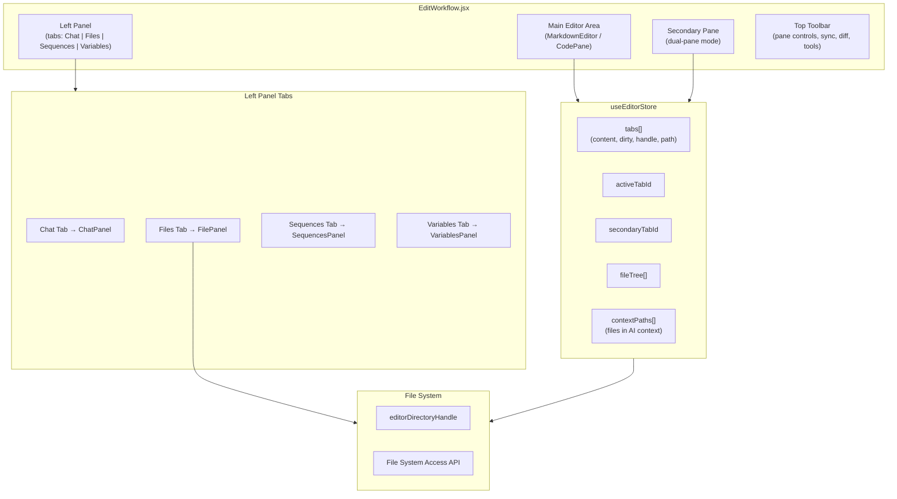
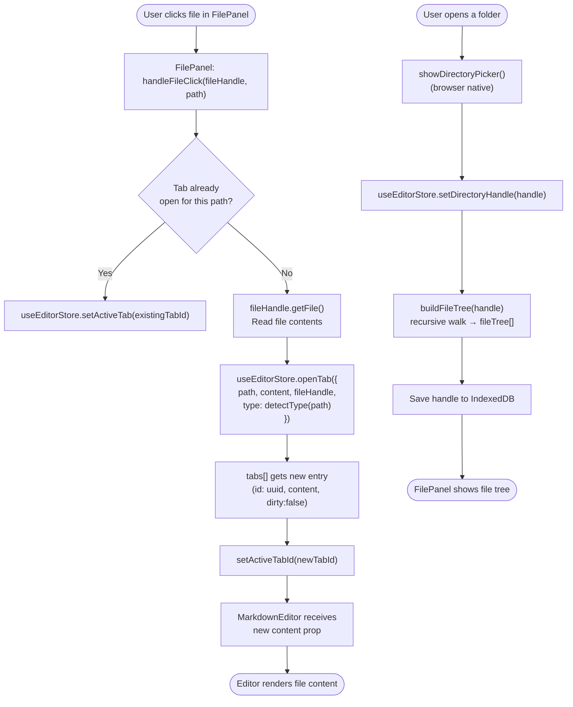
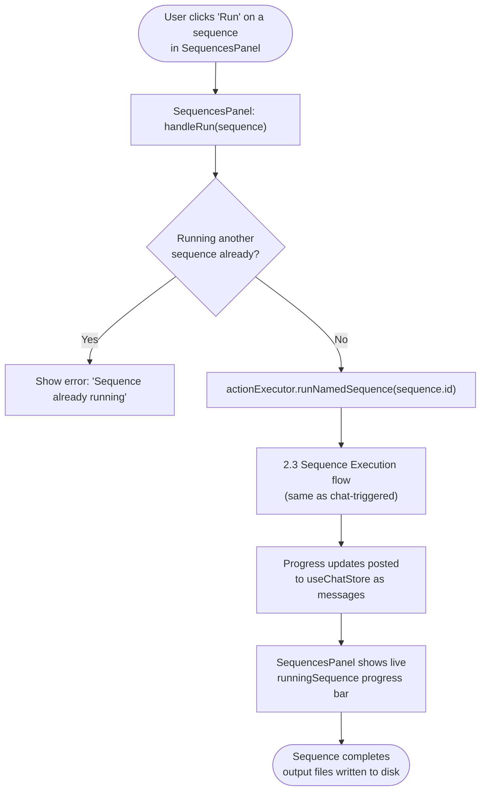
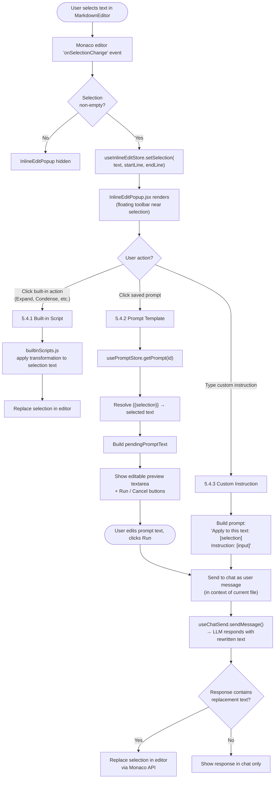
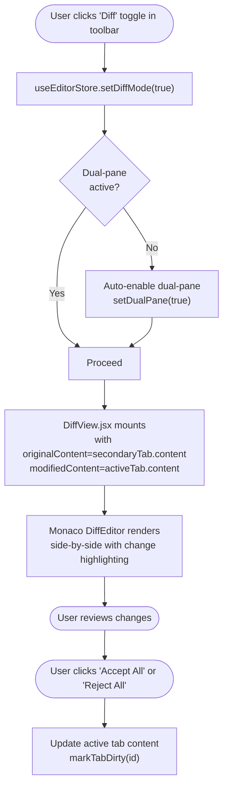
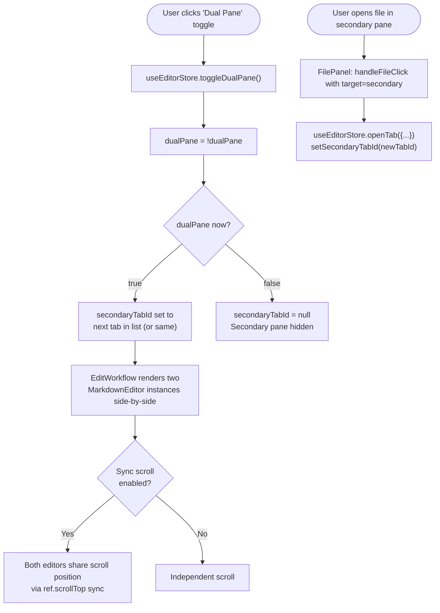
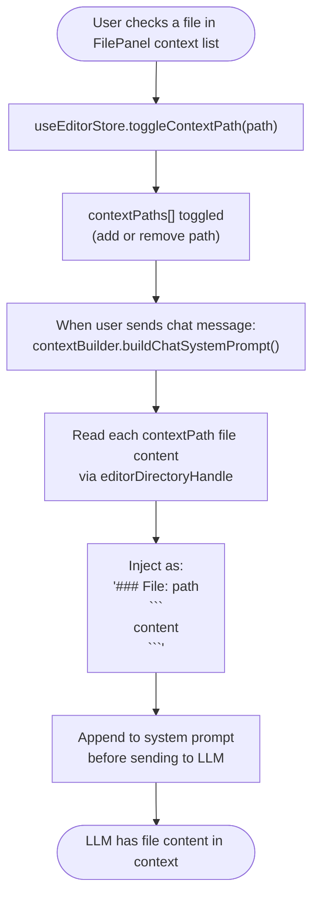

# 5 — Edit Workflow

> **Entry points covered:** Open file (5.1), Save file (5.2), Run sequence from edit panel (5.3), Inline edit popup (5.4), Diff view (5.5), Dual-pane (5.6), File context selection (5.7).

---

## 5.0 — Edit Workflow Overview



---

## 5.1 — Open File in Editor



---

## 5.2 — Save File

```mermaid
flowchart TD
    A([User presses Ctrl+S / Cmd+S]) --> B["EditWorkflow keydown handler"]
    B --> C["Get active tab from useEditorStore"]
    C --> D{Tab has\nfileHandle?}
    D -->|Yes| E["fileHandle.createWritable()\nwrite content\nclose writable"]
    D -->|No| F["showSaveFilePicker()\n(browser native)"]
    F --> G["User picks save location"]
    G --> H["Write content to new handle"]
    H --> I["useEditorStore.updateTab(id, {fileHandle: newHandle, dirty:false})"]
    E --> J["useEditorStore.markTabClean(id)"]
    I --> J
    J --> K([Tab title loses dirty indicator *])

    L([Tool call: writeFile(path, content)]) --> M["actionExecutor.writeFile(path, content)"]
    M --> N["Resolve path against\nactive book project handle"]
    N --> O["Navigate FileSystemDirectoryHandle\nto parent dir (create if missing)"]
    O --> P["fileHandle.createWritable()\nwrite + close"]
    P --> Q{Tab open\nfor this path?}
    Q -->|Yes| R["useEditorStore.updateTabContent(id, content)\nmarkTabClean(id)"]
    Q -->|No| S[File written to disk only]
    R --> T([Editor updates to reflect tool-written content])
```

---

## 5.3 — Run Sequence from Edit Panel



---

## 5.4 — Inline Edit Popup

Floating toolbar that appears when text is selected in the editor.



---

## 5.5 — Diff View



---

## 5.6 — Dual-Pane Mode



---

## 5.7 — File Context Selection (AI Context)

Files in the context panel are injected into the chat system prompt.



---

## 5.8 — Key Files

| File | Role |
|------|------|
| `src/components/edit/EditWorkflow.jsx` | Root; panel layout, keyboard shortcuts, resize logic |
| `src/components/edit/FilePanel.jsx` | File tree browser, context selection checkboxes |
| `src/components/edit/MarkdownEditor.jsx` | Monaco editor wrapper; theme, keybindings, autosave |
| `src/components/edit/InlineEditPopup.jsx` | Floating popup for selection-level editing |
| `src/components/edit/DiffView.jsx` | Monaco DiffEditor wrapper |
| `src/components/edit/SearchReplaceBar.jsx` | Ctrl+H search/replace overlay |
| `src/components/edit/SequencesPanel.jsx` | Sequence library UI inside edit workflow |
| `src/components/edit/ToolsDropdown.jsx` | Text transformation tools menu |
| `src/store/useEditorStore.js` | `tabs[]`, `openTab`, `closeTab`, `updateTabContent`, `markTabClean`, `contextPaths`, `fileTree` |
| `src/hooks/useInlineEdit.js` | Selection tracking, popup state |
| `src/hooks/useSearchReplace.js` | Search/replace logic |
| `src/services/arcwriteFS.js` | `readFileByPath` used by actionExecutor for file reads |
