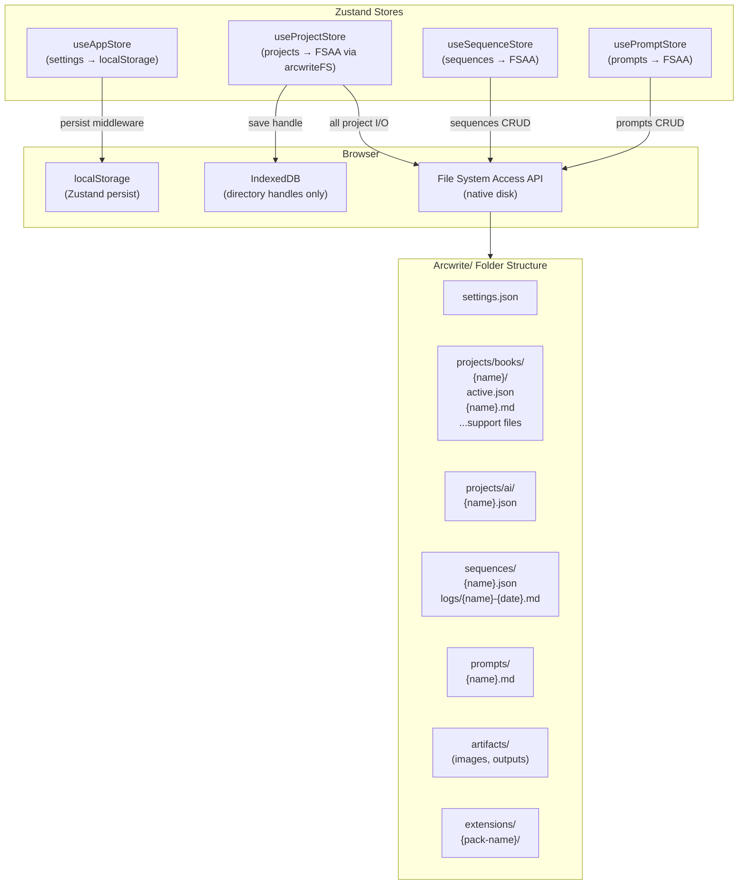
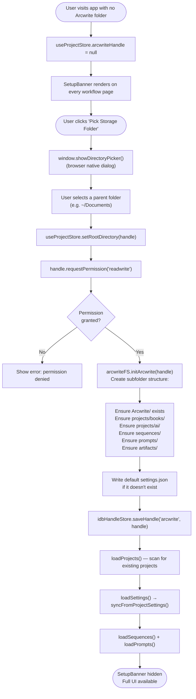
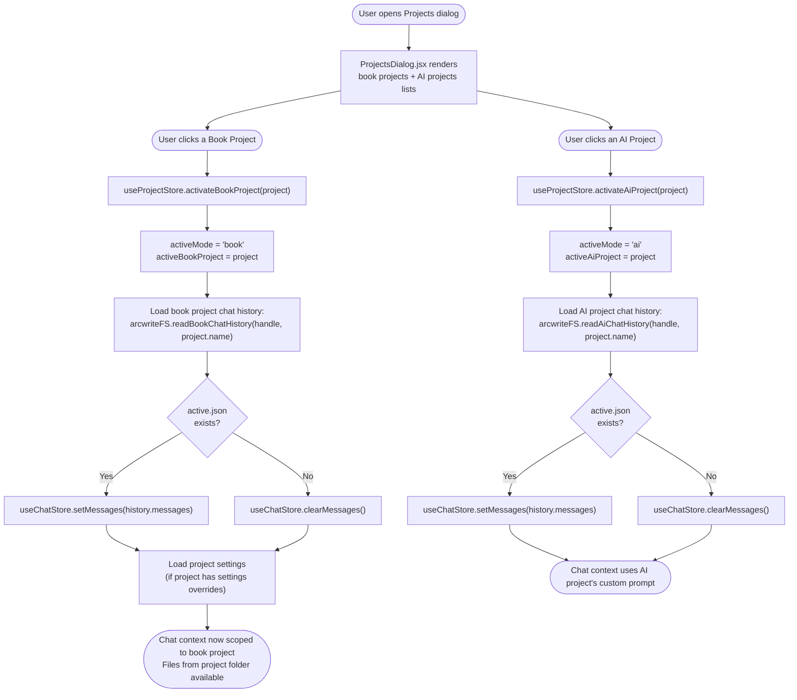
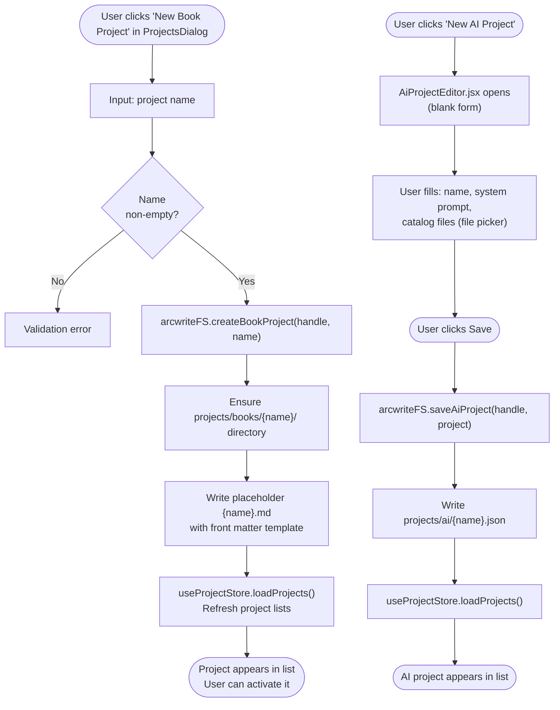
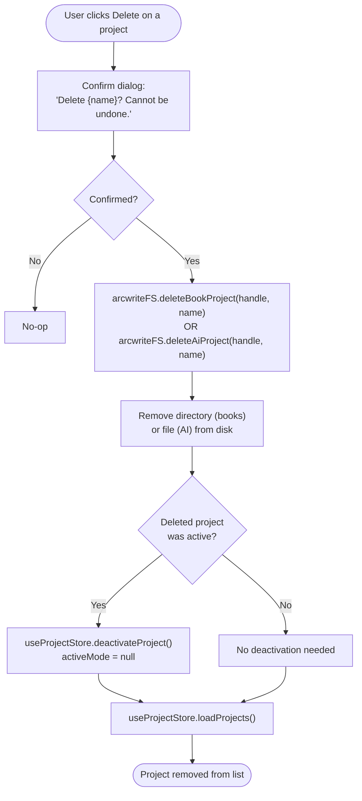
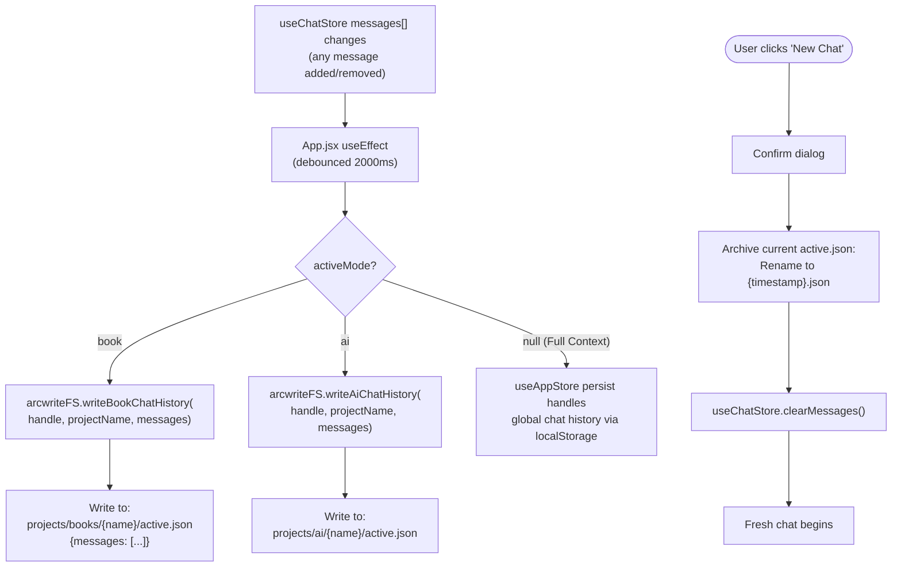
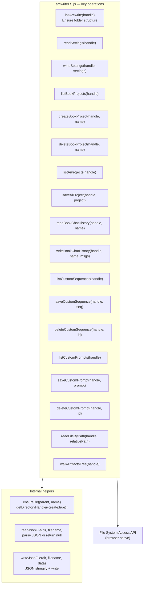
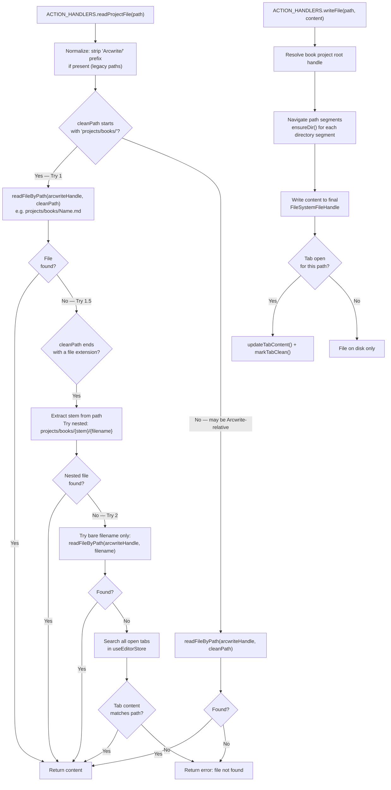

# 6 — Projects & Storage

> **Entry points covered:** First-run folder setup (6.1), Project switch (6.2), Create project (6.3), Delete project (6.4), Chat history persistence (6.5), File system layer / arcwriteFS (6.6), Path resolution for tool file reads (6.7).

---

## 6.0 — Storage Architecture Overview

---

## 6.1 — First-Run Folder Setup

---

## 6.2 — Project Switch

---

## 6.3 — Create Project

---

## 6.4 — Delete Project

---

## 6.5 — Chat History Persistence

---

## 6.6 — arcwriteFS File System Layer

The `arcwriteFS.js` service is the sole interface to the File System Access API for the Arcwrite folder. All path navigation is relative to the `arcwriteHandle` root.

---

## 6.7 — File Path Resolution (Tool Calls)

When the LLM or a sequence calls `readProjectFile(path)` or `writeFile(path, content)`, paths must be resolved relative to the correct handle. This is where the nested-folder bugs have historically occurred.

---

## 6.8 — Key Files

| File | Role |
|------|------|
| `src/services/arcwriteFS.js` | All Arcwrite/ I/O — projects, sequences, prompts, history, artifacts |
| `src/services/idbHandleStore.js` | `saveHandle`, `getHandle` — IndexedDB persistence for directory handles |
| `src/store/useProjectStore.js` | `setRootDirectory`, `restoreFromIDB`, `loadProjects`, `activateBookProject`, `activateAiProject`, `saveCurrentChatHistory` |
| `src/store/useSequenceStore.js` | `loadSequences`, `createSequence`, `updateSequence`, `deleteSequence` |
| `src/store/usePromptStore.js` | `loadPrompts`, `createPrompt`, `updatePrompt`, `deletePrompt` |
| `src/components/projects/ProjectsDialog.jsx` | Book/AI project list; activate, create, delete |
| `src/components/projects/AiProjectEditor.jsx` | Create/edit AI project definition |
| `src/components/projects/SetupBanner.jsx` | First-run folder picker UI |
| `src/chat/actionExecutor.js` | `readProjectFile`, `writeFile`, `writeArtifact` — resolve and execute file I/O |
