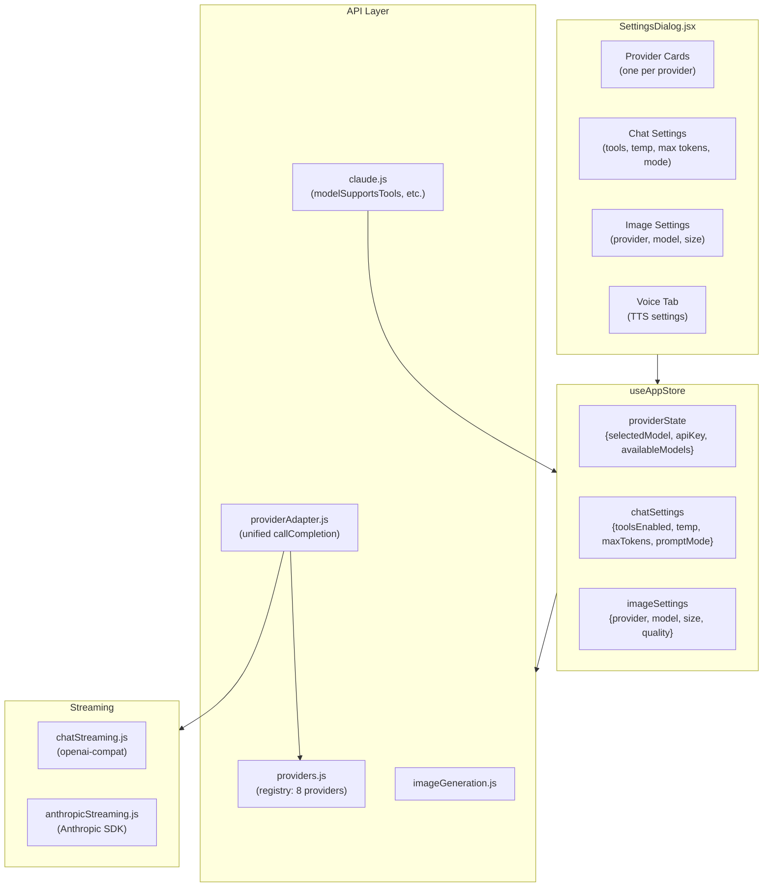
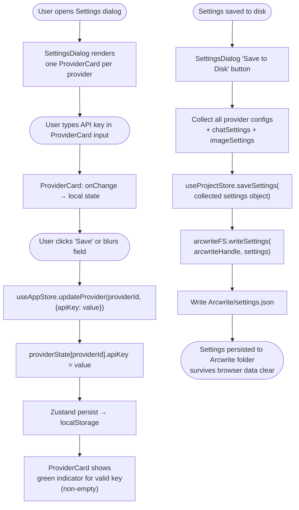
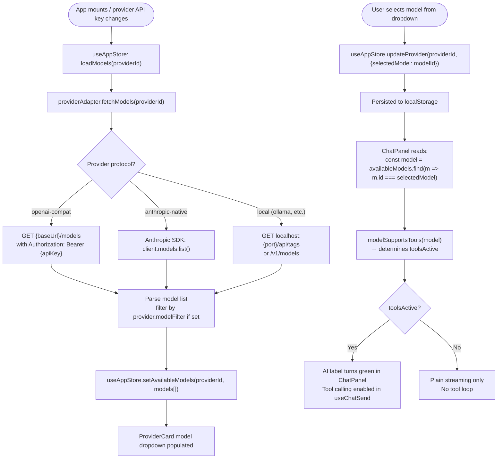
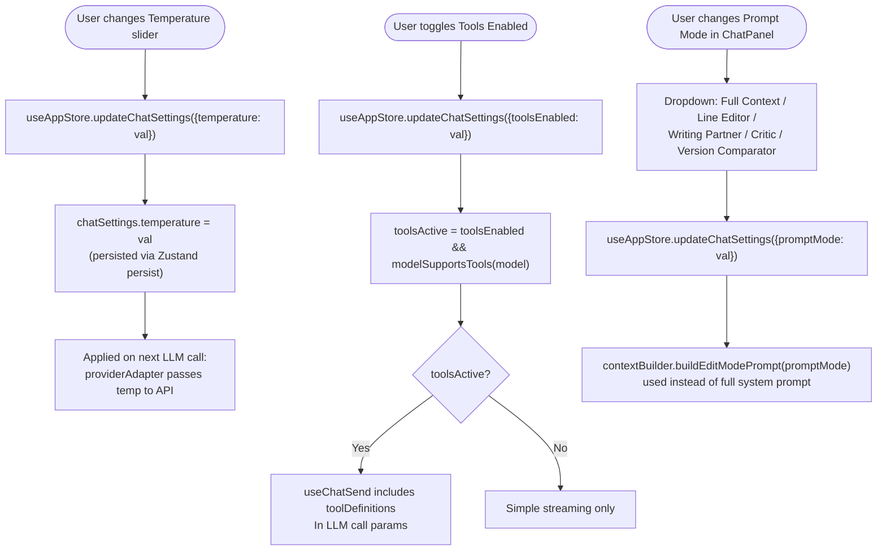
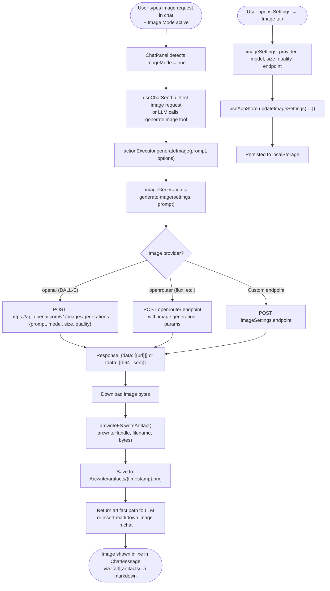
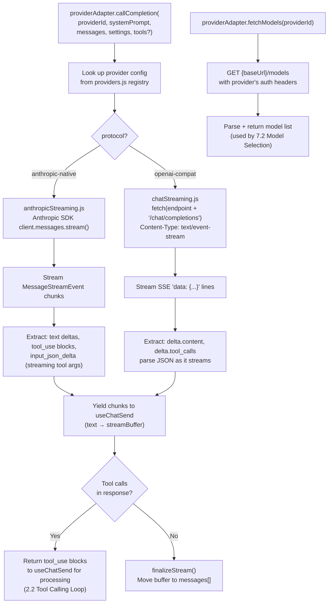
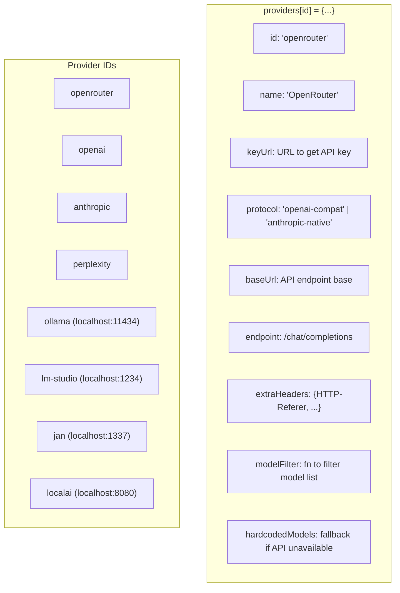

# 7 — Settings & Providers

> **Entry points covered:** Configure provider API key (7.1), Select model (7.2), Chat settings (7.3), Image generation (7.4), Provider adapter call path (7.5), Model capability detection (7.6).

---

## 7.0 — Settings & Provider Overview



---

## 7.1 — Configure Provider API Key



---

## 7.2 — Select Model



---

## 7.3 — Chat Settings



---

## 7.4 — Image Generation



---

## 7.5 — Provider Adapter Call Path

The unified interface that all LLM calls go through.



---

## 7.6 — Model Capability Detection

```mermaid
flowchart TD
    A["model object from availableModels[]"] --> B["claude.js: modelSupportsTools(model)"]
    B --> C{model has\nsupportedParameters?}
    C -->|Yes| D["return model.supportedParameters.includes('tools')"]
    C -->|No (local/unknown)| E["return false"]
    D --> F{toolsActive\n= toolsEnabled && result}
    E --> F
    F --> G["ChatPanel: AI label green if toolsActive"]
    F --> H["useChatSend: include toolDefinitions if toolsActive"]
    F --> I["ProviderCard: model name green if supportsTools"]
```

---

## 7.7 — Provider Registry Structure

Eight providers are defined in `src/api/providers.js`. Each has:



---

## 7.8 — Key Files

| File | Role |
|------|------|
| `src/api/providers.js` | Static registry of all 8 providers with connection details |
| `src/api/providerAdapter.js` | `callCompletion()`, `fetchModels()` — unified LLM interface |
| `src/api/chatStreaming.js` | SSE streaming + tool call parsing for openai-compat providers |
| `src/api/anthropicStreaming.js` | Anthropic SDK streaming implementation |
| `src/api/claude.js` | `modelSupportsTools()`, `modelSupportsReasoning()` |
| `src/api/imageGeneration.js` | `generateImage()` — DALL-E, Flux, custom endpoint |
| `src/components/settings/SettingsDialog.jsx` | Full settings modal |
| `src/components/settings/ProviderCard.jsx` | Per-provider key + model selector (model names in green if tools-capable) |
| `src/store/useAppStore.js` | `providerState`, `chatSettings`, `imageSettings`, `updateProvider`, `updateChatSettings` |
