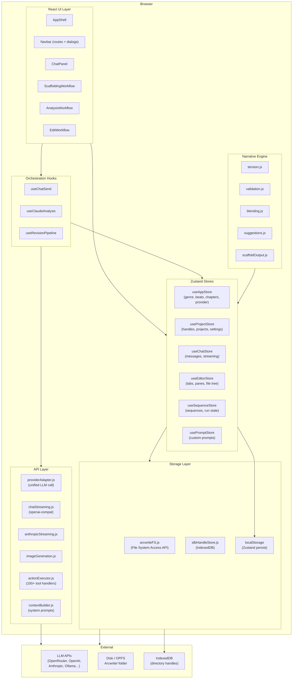
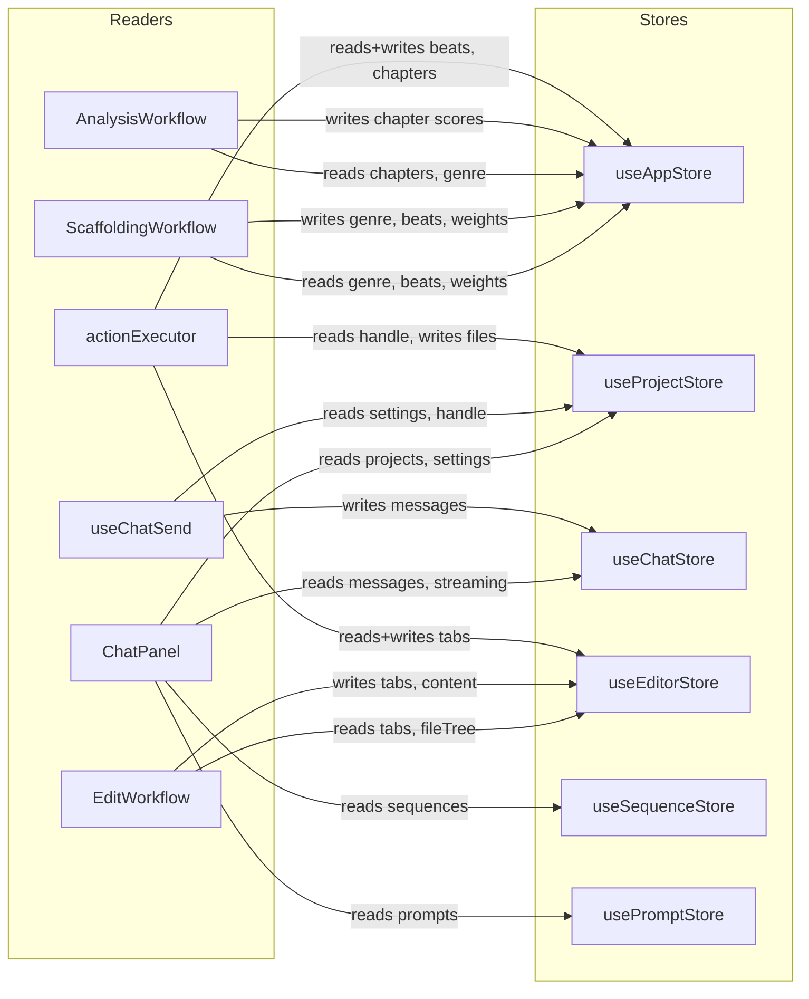
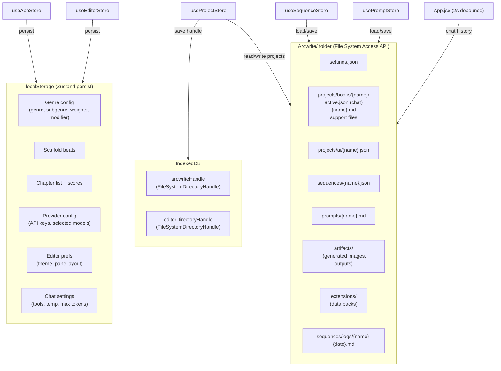

# Arcwright — System Architecture Index

> **Purpose:** Developer and contributor reference. Progressive elaboration — read the overview first, then drill into individual flow documents for detail.
>
> **Numbering convention:** `N` = major area, `N.M` = sub-flow within that area, `N.M.K` = step detail within a sub-flow.

---

## Documents

| File | Covers |
|------|--------|
| [INDEX.md](INDEX.md) | This file — system overview and component map |
| [01-startup.md](01-startup.md) | App bootstrap, IndexedDB restoration, store initialization |
| [02-chat.md](02-chat.md) | Chat panel, message send, tool calling loop, sequences, slash menu |
| [03-scaffold.md](03-scaffold.md) | Genre config, beat editing, tension engine, template load/save, export |
| [04-analyze.md](04-analyze.md) | Chapter scoring, gap analysis, get-well plan, projection |
| [05-edit.md](05-edit.md) | File editor, dual-pane, inline edit popup, diff view |
| [06-projects-storage.md](06-projects-storage.md) | Project setup, project switch, chat history persistence, arcwriteFS |
| [07-settings-providers.md](07-settings-providers.md) | Provider config, model selection, image generation |

---

## Level 0 — System Overview

The application is a single-page React app (Vite + React Router). All state is managed by Zustand stores. Persistence uses two layers: Zustand's `persist` middleware (localStorage) for settings, and the File System Access API (OPFS / native) for project files.

---

## Level 0.1 — Major User Entry Points (flat list)

Each entry point below links to the detailed flow document.

| # | Entry Point | Trigger | Flow Doc |
|---|-------------|---------|----------|
| 1.1 | App load — cold start (no handle) | Page load, no IndexedDB entry | [01-startup](01-startup.md) |
| 1.2 | App load — warm start (handle restored) | Page load, IDB has handle | [01-startup](01-startup.md) |
| 2.1 | Send chat message | Enter key / Send button | [02-chat](02-chat.md) |
| 2.2 | Tool calling loop | LLM returns tool_use blocks | [02-chat](02-chat.md) |
| 2.3 | Run named sequence | `/run "name"` in chat or Sequences panel | [02-chat](02-chat.md) |
| 2.4 | Slash menu — pick prompt | `/` typed in chat input | [02-chat](02-chat.md) |
| 2.5 | Abort stream | Stop button clicked mid-stream | [02-chat](02-chat.md) |
| 3.1 | Select genre | Genre dropdown change | [03-scaffold](03-scaffold.md) |
| 3.2 | Add / edit beat | `+` button or beat row expand | [03-scaffold](03-scaffold.md) |
| 3.3 | Drag-reorder beat | Drag handle | [03-scaffold](03-scaffold.md) |
| 3.4 | Load template | Template dropdown + Load button | [03-scaffold](03-scaffold.md) |
| 3.5 | Export scaffold | Markdown / HTML export button | [03-scaffold](03-scaffold.md) |
| 4.1 | Score chapter | Paste text + Analyze button | [04-analyze](04-analyze.md) |
| 4.2 | Get-Well Plan | Generate recommendations button | [04-analyze](04-analyze.md) |
| 4.3 | Toggle projection | Compare vs. scaffold toggle | [04-analyze](04-analyze.md) |
| 5.1 | Open file in editor | File tree click | [05-edit](05-edit.md) |
| 5.2 | Save file | Ctrl+S / auto-save | [05-edit](05-edit.md) |
| 5.3 | Run sequence from edit panel | Sequences tab Run button | [05-edit](05-edit.md) |
| 5.4 | Inline edit popup | Text selection → floating button | [05-edit](05-edit.md) |
| 6.1 | Pick storage folder (first run) | SetupBanner button | [06-projects-storage](06-projects-storage.md) |
| 6.2 | Switch project | Projects dialog select | [06-projects-storage](06-projects-storage.md) |
| 6.3 | Create new project | Projects dialog "New" | [06-projects-storage](06-projects-storage.md) |
| 7.1 | Configure provider | Settings dialog API key input | [07-settings-providers](07-settings-providers.md) |
| 7.2 | Select model | Settings dialog model dropdown | [07-settings-providers](07-settings-providers.md) |

---

## Level 0.2 — Store Dependency Map

Which stores each major component reads and writes.

---

## Level 0.3 — Persistence Layer Map

What gets stored where.

